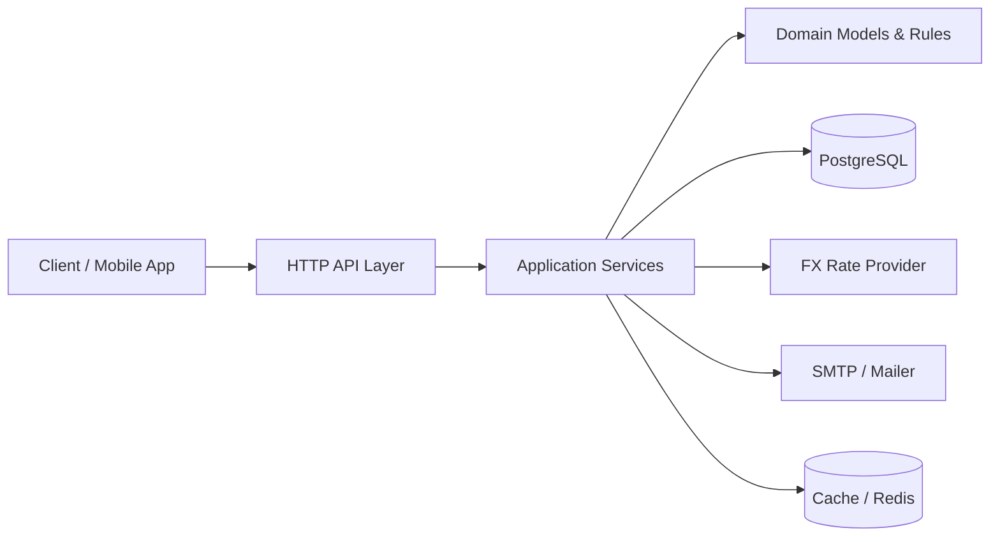
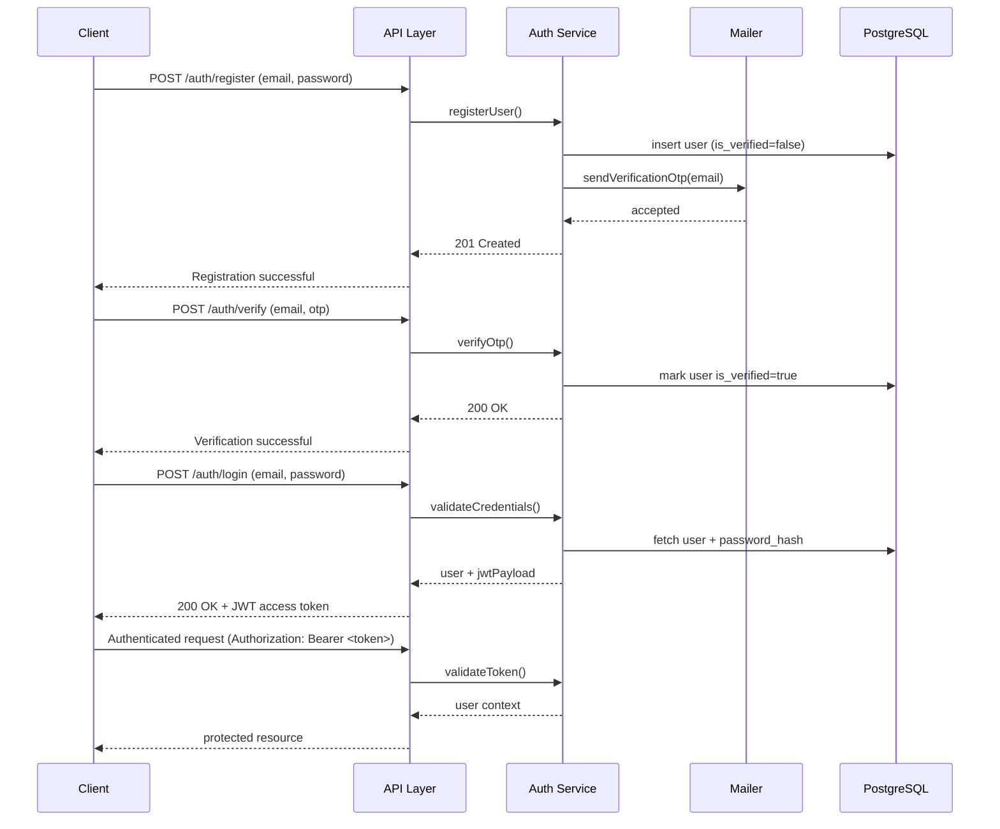
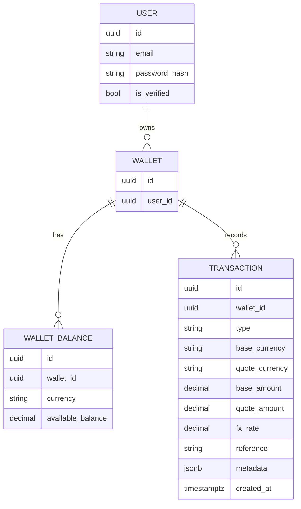
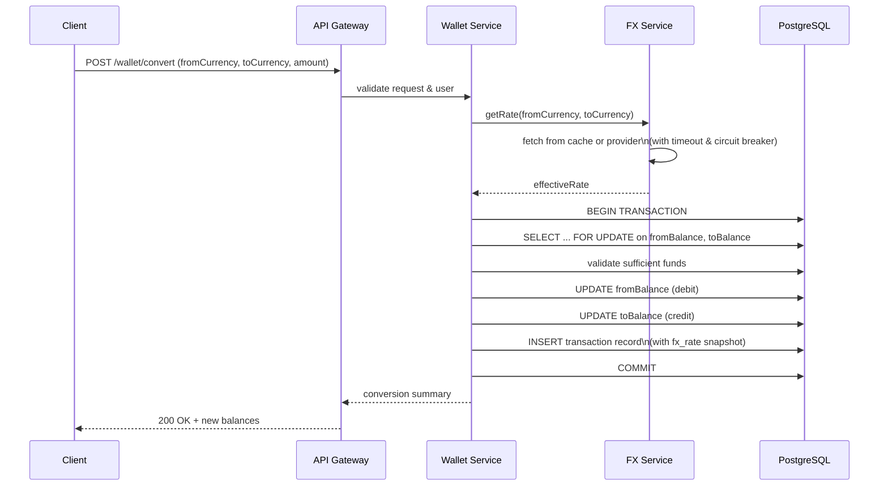
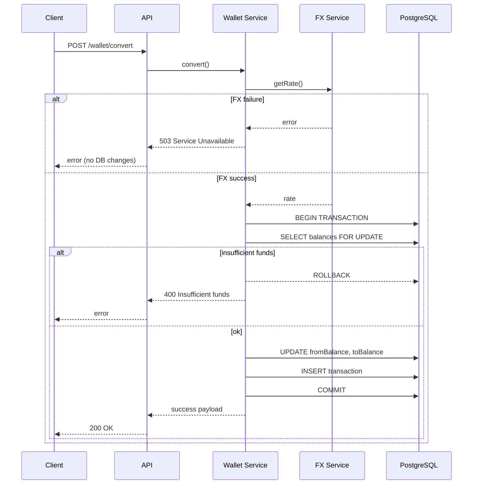
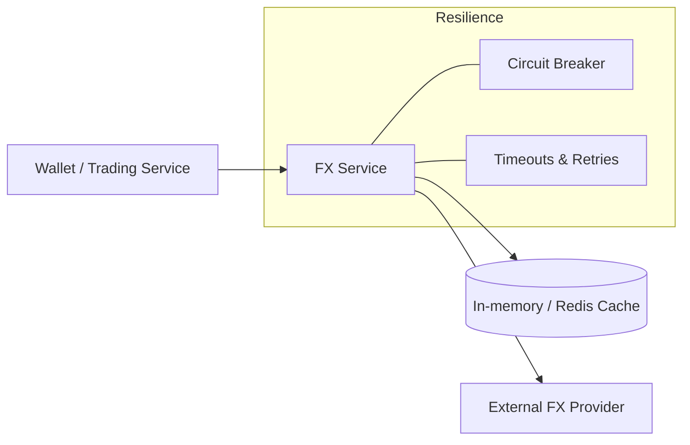
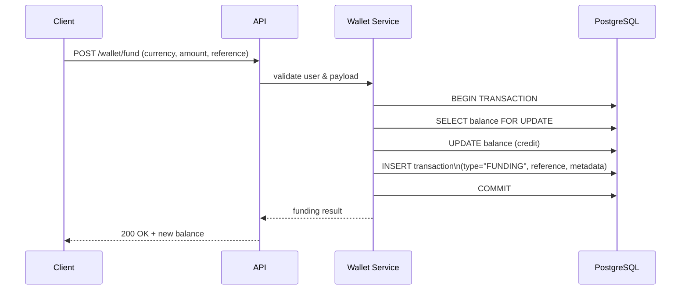
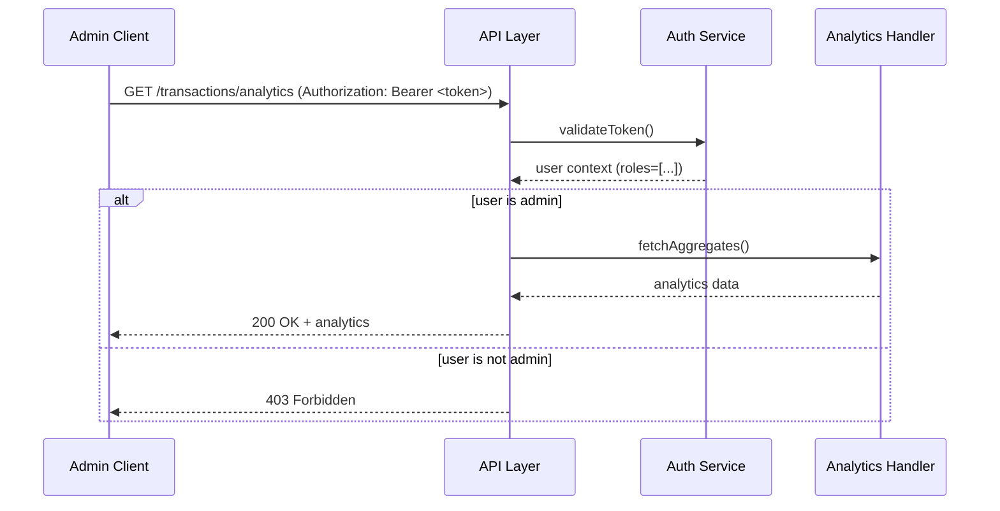

## FX Trading Backend

This is the backend for a simple FX trading app. It’s written in TypeScript on Node.js with PostgreSQL and gives each verified user a **multi-currency wallet**, **FX conversions / trades** and an **auditable transaction history**.

### What this service does

- **User onboarding & verification**
  - Email/password signup.
  - Email OTP verification before a user is allowed to move money.
- **Multi-currency wallet**
  - One wallet per user.
  - Per-currency balances (NGN, USD, EUR, GBP by default).
  - Funding and payouts in supported currencies.
- **Trading / conversion**
  - Convert from one currency to another using an external FX provider.
  - Store the exact FX rate used on every transaction.
  - Idempotent funding and conversion endpoints (no accidental double charges when clients retry).
- **Reporting & analytics**
  - Full list of wallet transactions.
  - Simple admin analytics endpoint for aggregate views.

### Design goals (in plain terms)

- **Balances must be correct** even under concurrent requests.
- **Every money movement must be explainable** later (audit trail).
- **Deployment should be boring**: a single service + Postgres (+ optional Redis).

### Tech stack (high-level)

- **Runtime**: Node.js (TypeScript)
- **HTTP layer**: REST API (implemented with NestJS, but structured around domains, not controllers first)
- **Database**: PostgreSQL (TypeORM)
- **Auth**: JWT + email/OTP verification
- **Mail**: SMTP via Nodemailer
- **FX rates**: External HTTP API with caching and a circuit breaker in front

---

### Getting started

1. **Prerequisites**
  - Node.js and npm
  - PostgreSQL running and reachable
  - (Optional) SMTP account for sending emails
2. **Install dependencies**

```bash
cd fx-trading-backend
npm install
```

1. **Configure environment**

Create a `.env` file in the project root:

```bash
DB_HOST=localhost
DB_PORT=5432
DB_USER=postgres
DB_PASSWORD=postgres
DB_NAME=fx_trading

JWT_SECRET=change_me

SMTP_HOST=smtp.example.com
SMTP_PORT=587
SMTP_USER=your-user
SMTP_PASS=your-pass
SMTP_FROM=no-reply@example.com

FX_API_URL=https://api.exchangerate.host/live
FX_API_KEY=YOUR_ACCESS_KEY_HERE
FX_CACHE_TTL_MS=60000
FX_HTTP_TIMEOUT_MS=5000
FX_MAX_FAILURES=5
FX_CIRCUIT_OPEN_MS=30000
FX_SUPPORTED_CURRENCIES=NGN,USD,EUR,GBP

# Optional: Redis cache for FX rates
REDIS_HOST=localhost
REDIS_PORT=6379

# Admin seeder (run: npm run seed:admin)
ADMIN_EMAIL=mendyslam@gmail.com
ADMIN_PASSWORD=StrongP@ssw0rd

# Optional: comma-separated list of alert recipients for critical errors
ALERT_EMAIL_TO=ops@example.com,devoncall@example.com
```

1. **Run the app locally**

```bash
npm run start:dev
```

The server listens on `http://localhost:3000`.

### Running with Docker

If we don’t want to install Postgres locally:

```bash
docker compose up --build
```

This will start:

- **db**: PostgreSQL on port `5432`
- **api**: Trading backend on port `3000`

Environment variables are wired via `docker-compose.yml` and can be overridden as needed.

### API documentation

- **Swagger UI (interactive docs)**: `http://localhost:3000/api-docs`
- **OpenAPI JSON**: `http://localhost:3000/api-json`
- **Published Postman documentation**: [FX Trading Backend (Postman)](https://documenter.getpostman.com/view/43502486/2sBXihpY4t)

Main groups (from Swagger):

- **Auth**
  - `POST /auth/register`
  - `POST /auth/verify`
  - `POST /auth/login`
- **Wallet**
  - `GET /wallet`
  - `POST /wallet/fund`
  - `POST /wallet/convert`
  - `POST /wallet/trade`
- **FX**
  - `GET /fx/rates`
- **Transactions**
  - `GET /transactions`
  - `GET /transactions/analytics` (admin only)

### Example requests

Below are a few concrete examples. For the full contract, see Swagger.

**Register → verify → login**

```http
POST /auth/register
Content-Type: application/json

{
  "email": "user@example.com",
  "password": "StrongPassw0rd!"
}
```

```http
POST /auth/verify
Content-Type: application/json

{
  "email": "user@example.com",
  "code": "123456"
}
```

```http
POST /auth/login
Content-Type: application/json

{
  "email": "user@example.com",
  "password": "StrongPassw0rd!"
}
```

Successful login returns a JWT access token:

```json
{
  "accessToken": "<jwt-token-here>"
}
```

**Get wallet & balances**

```http
GET /wallet
Authorization: Bearer <jwt-token>
```

Example response:

```json
[
  {
    "currency": "NGN",
    "balance": "15000.00"
  },
  {
    "currency": "USD",
    "balance": "10.50"
  }
]
```

**Fund wallet**

```http
POST /wallet/fund
Authorization: Bearer <jwt-token>
Content-Type: application/json
Idempotency-Key: 9b87b9a2-4f9f-4a39-9a5e-123456789abc

{
  "amount": 10000,
  "currency": "NGN"
}
```

Example response:

```json
{
  "id": "d1a2130d-7b9c-4c52-9f1c-0f9d90e4b5f2",
  "type": "FUND",
  "status": "COMPLETED",
  "amountFrom": "10000.00",
  "currencyFrom": "NGN",
  "amountTo": null,
  "currencyTo": null,
  "rate": null,
  "createdAt": "2026-03-17T10:15:30.000Z"
}
```

**Convert (or trade)**

```http
POST /wallet/convert
Authorization: Bearer <jwt-token>
Content-Type: application/json
Idempotency-Key: 4c4af2d0-2a59-4a2b-9e21-abcdefabcdef

{
  "fromCurrency": "NGN",
  "toCurrency": "USD",
  "amount": 5000
}
```

**Execute a trade**

`POST /wallet/trade` has the same shape as `POST /wallet/convert`, but is treated as a trade in reporting:

```http
POST /wallet/trade
Authorization: Bearer <jwt-token>
Content-Type: application/json
Idempotency-Key: 1d8b5f0e-3a6c-4b9f-9c2d-fedcba987654

{
  "fromCurrency": "USD",
  "toCurrency": "NGN",
  "amount": 10
}
```

Example response (note `type: "TRADE"`):

```json
{
  "id": "f44c2c7b-8b9c-4a7a-b88f-7a9e51f3f222",
  "type": "TRADE",
  "status": "COMPLETED",
  "amountFrom": "10.00",
  "currencyFrom": "USD",
  "amountTo": "8100.00",
  "currencyTo": "NGN",
  "rate": "810.000000",
  "metadata": {
    "fxBase": "NGN",
    "ratesSnapshotAt": "2026-03-17T10:20:00.000Z"
  },
  "createdAt": "2026-03-17T10:20:05.000Z"
}
```

**Get FX rates**

```http
GET /fx/rates
Authorization: Bearer <jwt-token>
```

Example response (trimmed):

```json
{
  "base": "NGN",
  "fetchedAt": "2026-03-17T10:15:00.000Z",
  "rates": {
    "USD": 0.001224,
    "EUR": 0.001102,
    "GBP": 0.000945
  }
}
```

**List transactions**

```http
GET /transactions?limit=20&cursor=<optional-cursor>
Authorization: Bearer <jwt-token>
```

Example response (trimmed):

```json
{
  "items": [
    {
      "id": "d1a2130d-7b9c-4c52-9f1c-0f9d90e4b5f2",
      "type": "FUND",
      "status": "COMPLETED",
      "amountFrom": "10000.00",
      "currencyFrom": "NGN",
      "createdAt": "2026-03-17T10:15:30.000Z"
    },
    {
      "id": "8c6c8ed4-78dd-4c1d-a5a4-470a0a9f7a11",
      "type": "CONVERT",
      "status": "COMPLETED",
      "amountFrom": "5000.00",
      "currencyFrom": "NGN",
      "amountTo": "6.12",
      "currencyTo": "USD",
      "createdAt": "2026-03-17T10:15:32.000Z"
    }
  ],
  "nextCursor": "eyJpZCI6IjhjNmM4ZWQ0LTc4ZGQtNGMxZC1hNWE0LTQ3MGEwYTlmN2ExMSJ9"
}
```

**Admin analytics**

```http
GET /transactions/analytics?from=2026-03-01&to=2026-03-31&includeDaily=true
Authorization: Bearer <admin-jwt-token>
```

- `**from` / `to**`: optional ISO dates; omit both for all-time.
- `**includeDaily=true**`: adds `dailyTrends` (per UTC day) when both dates are set and the range is ≤ 366 days; otherwise `notes` may explain omission.

Response includes:

- `**period**`: applied `from` / `to` (ISO or `null`).
- `**summary**`: `totalTransactions`, `uniqueWallets`, `byStatus`, `byType`, `completionRateByCount`, `completionRateByVolume`.
- `**volumeByCurrency**`: per `currencyFrom`, counts by outcome and volume (completed vs all).
- `**byType**`: FUND / CONVERT / TRADE with status split and amounts.
- `**dailyTrends**` (optional): day, counts, completed volume.
- `**notes**` (optional): e.g. when daily series was skipped for a long range.

Example response:

```json
{
  "period": {
    "from": "2026-03-01T00:00:00.000Z",
    "to": "2026-03-31T23:59:59.999Z"
  },
  "summary": {
    "totalTransactions": 245,
    "uniqueWallets": 32,
    "byStatus": {
      "COMPLETED": 220,
      "PENDING": 10,
      "FAILED": 15
    },
    "byType": {
      "FUND": 140,
      "CONVERT": 60,
      "TRADE": 45
    },
    "completionRateByCount": 0.898,
    "completionRateByVolume": 0.934
  },
  "volumeByCurrency": [
    {
      "currencyFrom": "NGN",
      "transactionCount": 180,
      "completedCount": 165,
      "failedCount": 10,
      "pendingCount": 5,
      "totalAmountFromCompleted": "2500000.00",
      "totalAmountFromAll": "2675000.00"
    },
    {
      "currencyFrom": "USD",
      "transactionCount": 65,
      "completedCount": 55,
      "failedCount": 5,
      "pendingCount": 5,
      "totalAmountFromCompleted": "15000.00",
      "totalAmountFromAll": "15800.00"
    }
  ],
  "byType": [
    {
      "type": "FUND",
      "totalCount": 140,
      "byStatus": {
        "COMPLETED": 135,
        "FAILED": 3,
        "PENDING": 2
      },
      "totalAmountFromAll": "3000000.00",
      "totalAmountFromCompleted": "2950000.00"
    },
    {
      "type": "CONVERT",
      "totalCount": 60,
      "byStatus": {
        "COMPLETED": 50,
        "FAILED": 6,
        "PENDING": 4
      },
      "totalAmountFromAll": "750000.00",
      "totalAmountFromCompleted": "700000.00"
    }
  ],
  "dailyTrends": [
    {
      "day": "2026-03-01",
      "transactionCount": 12,
      "completedCount": 11,
      "failedCount": 1,
      "pendingCount": 0,
      "totalAmountFromCompleted": "120000.00"
    }
  ]
}
```

### How I work with this locally

- Start Postgres (and Redis if you want caching beyond in-memory).
- Export `.env`.
- Run:

```bash
npm run start:dev
```

- Use Swagger or your REST client to hit endpoints.

If the `Makefile` is present in our setup, we can also rely on shortcuts like `make dev` and `make test`.

---

## Architecture & Design Decisions

### High-level architecture

The system is designed as a layered monolith with clear separation between:

- **Presentation layer**: HTTP controllers, validation, and request/response mapping.
- **Application layer**: Use-cases / services that orchestrate workflows (fund wallet, convert currency, execute trade).
- **Domain layer**: Core business logic around users, wallets, FX rates, and transactions.
- **Infrastructure layer**: Database (PostgreSQL via TypeORM), email provider, FX rate provider, cache, and logging.




**Key decisions**

- **Single service, modular domains**: Everything runs in one deployable unit to keep ops simple, but domains (`auth`, `wallet`, `fx`, `transactions`) are isolated via modules/services.
- **Relational database**: PostgreSQL is used to guarantee consistency for balances and transactions.
- **Strongly consistent wallet operations**: All balance-changing operations run inside DB transactions with row-level locking to prevent race conditions and double-spends.
- **External FX provider with resilience**: FX rates come from an external API wrapped by caching, timeouts, and a circuit breaker.
- **Auditability first**: Every change in balance is captured as a transaction record with references to the initiating operation.

### Domain modules (conceptual)

At a high level, the codebase is organized around the following domains:

- **Auth**: User registration, login, OTP verification, and JWT token handling.
- **Wallet**: Wallet creation, balance management, funding and payouts.
- **FX**: Integration with external FX provider(s), caching, and resilience policies.
- **Transactions**: Persistence and querying of the immutable ledger.

### Auth & session flow




---

## Wallet & Balance Model

### Conceptual data model

- **User**: Authenticated actor with email/password and verification status.
- **Wallet**: One per user, aggregates balances across currencies.
- **WalletBalance**: Per-currency balance row (`wallet_id`, `currency`, `available_balance`).
- **Transaction**: Immutable ledger of operations (funding, conversion, trade).




### Wallet invariants

- **Single wallet per user**: Simplifies UX and accounting; multi-wallet can be layered later.
- **Non-negative balances**: Business rules prevent debits that would take any currency below zero.
- **Immutable transactions**: Transactions are append-only; corrections happen via compensating entries, not in-place updates.

### Amounts, rounding & precision

- Monetary amounts are stored as **fixed-precision decimals** at the database level.
- FX conversions follow the pattern:
  -  quoteAmount = baseAmount \times fxRate 
  - Application-level rounding rules (e.g., 2 decimal places for fiat) are applied before persistence and response.
- Any change to rounding rules should be treated as a **breaking change** for financial reporting and must be accompanied by a migration strategy.

---

## Trading & Conversion Flow

### Core flows and assumptions

- **User lifecycle**
  - User registers with email/password.
  - A one-time password (OTP) is emailed for verification.
  - Only verified users can fund wallets or trade.
- **Wallet lifecycle**
  - A wallet is created when the user completes registration.
  - Per-currency balances are lazily initialized (row created on first use).
- **FX rates**
  - Rates are fetched on demand from an external provider.
  - Responses are cached for a short TTL to reduce latency and cost.
  - A snapshot of the rate used for each trade/conversion is stored with the transaction for auditability.

### Trading / conversion sequence




**Implementation highlights**

- **Transactional safety**: All balance mutations (fund, convert, trade) are wrapped in a single DB transaction using row-level locks (`SELECT ... FOR UPDATE`) on the relevant `WalletBalance` rows.
- **Idempotency**: Funding and trade endpoints accept an `Idempotency-Key` header; repeated requests with the same key will not double-process the operation.
- **FX snapshotting**: The FX rate used at the time of the transaction is stored alongside amounts, making ledger replays and audits deterministic.

### Error & rollback behavior (conversion)




### Trading risk & limits (baseline)

Out of the box, the service assumes:

- No leverage or margin; trades are fully cash-backed.
- No per-user or global rate limiting; these can be enforced at the gateway/API layer.
- No complex order book; conversions are priced directly off FX provider quotes.

If you need risk controls (per-user limits, daily caps, or rate limits), the recommended approach is to:

- Add a `risk` domain/module.
- Introduce pre-trade checks in the application layer before wallet debits occur.

---

## FX Rate Handling & Resilience

### FX provider abstraction

The backend talks to FX providers through an interface, so the underlying HTTP API can be swapped without touching business logic.

- **Responsibilities**
  - Normalize provider responses into a common rate model.
  - Enforce configured timeouts.
  - Maintain an error counter for circuit breaking.
  - Cache successful responses for a configurable TTL.




**Design choices**

- **Cache-then-network**: Reads hit the cache first; on miss, the provider is queried and the result is cached.
- **Circuit breaker**: After repeated failures, the circuit trips open for a period; during that time, the service returns the last known good rate (if allowed) or fails fast.
- **Config-driven**: TTLs, max failures, and open duration are all configurable via environment variables.

### Failure modes & behavior

- **Provider timeout**: Request is aborted after `FX_HTTP_TIMEOUT_MS`; an error is returned to the client (with safe defaults, no partial updates).
- **Provider unavailable / circuit open**:
  - If a last known rate is available and the business rule allows, it can be used as a fallback.
  - Otherwise, the trade/conversion is rejected with a retriable error.
- **Cache poisoning prevention**: Only successful responses that pass validation are cached.

---

## Wallet Funding & Payout Flow




**Decisions**

- **External PSP integration ready**: The `reference` and `metadata` fields on transactions are designed to store payment provider IDs and payloads.
- **Single source of truth**: Final balances are always derived from `WalletBalance` rows; `Transaction` is an immutable audit log, not a cached balance.

Payouts (transfers from wallet back to external rails) can be implemented as:

- A new transaction type (e.g., `PAYOUT`) that debits the corresponding wallet balance.
- Integration with a payment provider that is triggered after the DB transaction commits successfully.

---

## Security & Compliance Considerations

- **Authentication**
  - JWT-based auth with access tokens.
  - OTP-based email verification required before financial operations.
- **Authorization**
  - Role-aware endpoints (e.g., admin-only analytics).
  - Resource scoping: wallet and transactions are always filtered by `user_id`.

### Admin analytics authorization flow




- **Data protection**
  - Passwords stored as salted hashes.
  - Sensitive secrets provided via environment variables, not source control.
- **Operational safety**
  - Input validation on all public endpoints.
  - Structured logging of critical flows (auth, funding, trading, FX failures).

### Observability

- Request-scoped logging with operation identifiers is recommended for:
  - Auth flows (especially OTP verification).
  - Funding and trade operations.
  - FX provider failures and circuit-breaker events.
- Metrics we may want to expose:
  - FX provider latency and error rates.
  - Trade and funding volume per currency.
  - Balance of circuit-breaker states (open/half-open/closed).

---

## Testing

Run the test suite:

```bash
npm test
```

The suite focuses on:

- Core service wiring.
- Wallet funding/conversion flows.
- FX service behaviors (caching, circuit breaker) via mocks.

You can extend it with:

- End-to-end tests covering registration → verification → funding → trade.
- Regression tests around rounding rules and boundary amounts.

---

